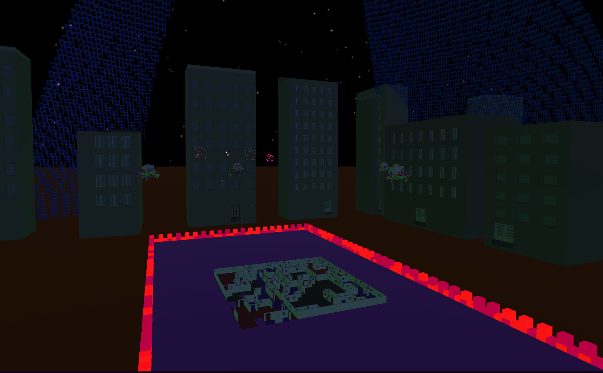

# Procedurally Generated City

A futuristic city built using procedural generation. The city builds a random maze each time the player hits the 'E' key and also builds a random roof cover with each restart of the game.

## How To Play - 2 Options
Option 1. Clone this repo and open within Unity.

Option 2. Go to my Itch.io page https://unflappedoyster.itch.io/the-maze and play it in the browser as a mini-game about navigating a maze to find the glowing orbs.
